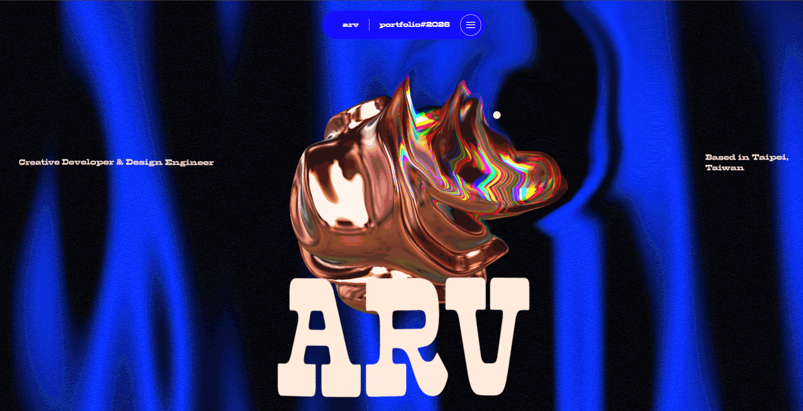

# Arv — Portfolio 2026

Personal portfolio of Arv, Creative Developer & Design Engineer. An interactive WebGL experience built with Next.js, Three.js and GSAP.

### 🔗 [Live site → 4th-threejs-project.vercel.app](https://4th-threejs-project.vercel.app/)

[](https://4th-threejs-project.vercel.app/)

## 🌟 Features

-   **Modern Stack**: Built with Next.js, TypeScript, and Tailwind CSS
-   **3D Graphics**: Powered by Three.js with custom GLSL shaders
-   **Smooth Animations**: Implemented using GSAP and Lenis smooth scrolling
-   **Optimal Performance**: Static Site Generation (SSG) for fast load times
-   **Responsive Design**: Fully responsive across all devices

## 🛠️ Tech Stack

-   TypeScript
-   Next.js
-   Three.js / React Three Fiber
-   GLSL
-   GSAP
-   Tailwind CSS
-   Zustand (State Management)

## 🚀 Getting Started

```bash
npm install
npm run dev
```

Open [http://localhost:3000](http://localhost:3000).

### Production build

```bash
npm run build       # outputs a static site to ./out
npm run post-build  # optimizes script loading in the generated HTML
npx serve out
```

### Docker

```bash
docker compose up --build
```

Then open [http://localhost:7878](http://localhost:7878).

## 🙏 Credits

Based on the open-source portfolio by [Layne Chen](https://github.com/laynesquare/layne-chen-portfolio).
